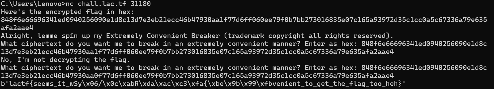

# LACTF WriteUp


## Crypto

### big e

```python
from Crypto.Util.number import bytes_to_long, getPrime

flag = REDACTED

pt = bytes_to_long(flag)

p = getPrime(1024)
q = getPrime(1024)
n = p*q

e_1 = getPrime(16)
e_2 = getPrime(16)

ct_1 = pow(pt, e_1, n)
ct_2 = pow(pt, e_2, n)
print("ct_1 = ", ct_1)
print("ct_2 = ", ct_2)

print("e_1 = ", e_1)
print("e_2 = ", e_2)

print("n = ", n)

# ct_1 =  7003427993343973209633604223157797389179484683813683779456722118278438552981580821629201099609635249903171901413187274301782131604125932440261436398792561279923201353644665062240232628983398769617870021735462687213315384230009597811708620803976743966567909514341685037497925118142192131350408768935124431331080433697691313467918865993755818981120044023483948250730200785386337033076398494691789842346973681951019033860698847693411061368646250415931744527789768875833220281187219666909459057523372182679170829387933194504283746668835390769531217602348382915358689492117524129757929202594190396696326156951763154356777
# ct_2 =  2995334251818636287120912468673386461522795145344535560487265325864722413686091982727438605788851631192187299910519824438553287094479216297828199976116043039048528458879462591368580247044838727287694258607151549844079706204392479194688578102781851646467977751150658542264776551648799517340378173131694653270749425410071080383488918100565955153958793977478719703463115004497213753735577027928062856483316183232075922059366731900291340025009516177568909257605255717594938087543899066756942042664781424833498278544829618874970165660669400140113047048269742309745649848573501494088032718459018143817236079173978684104782
# e_1 =  49043
# e_2 =  60737
# n =  9162219874876832806204248523866163938680921861751582550947065673035037752546476053774362284605943422397285024205866696280912237827227700515353007344062472274717294484810421409217463791112287997964358655519896402380272695026012981743782564008035342746214988154836484419372449523768063368280069515180570625408254410932129769708259508451185553774810385066789146531683973766796965747310893648672657945403825359068647151094841570404979930542270681833162424933411724266687320976217446032292107871449464575533610369244978941764470549091443086646932177141081314452355708815370388814214178980532690792441231698974328523197187
```

一个简单的共模攻击，签到题了算是

直接上py脚本：

```python
from Crypto.Util.number import long_to_bytes

ct_1 = 7003427993343973209633604223157797389179484683813683779456722118278438552981580821629201099609635249903171901413187274301782131604125932440261436398792561279923201353644665062240232628983398769617870021735462687213315384230009597811708620803976743966567909514341685037497925118142192131350408768935124431331080433697691313467918865993755818981120044023483948250730200785386337033076398494691789842346973681951019033860698847693411061368646250415931744527789768875833220281187219666909459057523372182679170829387933194504283746668835390769531217602348382915358689492117524129757929202594190396696326156951763154356777
ct_2 = 2995334251818636287120912468673386461522795145344535560487265325864722413686091982727438605788851631192187299910519824438553287094479216297828199976116043039048528458879462591368580247044838727287694258607151549844079706204392479194688578102781851646467977751150658542264776551648799517340378173131694653270749425410071080383488918100565955153958793977478719703463115004497213753735577027928062856483316183232075922059366731900291340025009516177568909257605255717594938087543899066756942042664781424833498278544829618874970165660669400140113047048269742309745649848573501494088032718459018143817236079173978684104782
e_1 = 49043
e_2 = 60737
n = 9162219874876832806204248523866163938680921861751582550947065673035037752546476053774362284605943422397285024205866696280912237827227700515353007344062472274717294484810421409217463791112287997964358655519896402380272695026012981743782564008035342746214988154836484419372449523768063368280069515180570625408254410932129769708259508451185553774810385066789146531683973766796965747310893648672657945403825359068647151094841570404979930542270681833162424933411724266687320976217446032292107871449464575533610369244978941764470549091443086646932177141081314452355708815370388814214178980532690792441231698974328523197187

def extended_gcd(a, b):
    old_r, r = a, b
    old_s, s = 1, 0
    old_t, t = 0, 1
    while r != 0:
        quotient = old_r // r
        old_r, r = r, old_r - quotient * r
        old_s, s = s, old_s - quotient * s
        old_t, t = t, old_t - quotient * t
    return old_r, old_s, old_t

gcd, a, b = extended_gcd(e_1, e_2)
print(f"GCD: {gcd}, a: {a}, b: {b}")

# 计算各部分并处理负数指数
if a < 0:
    ct1_inv = pow(ct_1, -1, n)
    part1 = pow(ct1_inv, -a, n)
else:
    part1 = pow(ct_1, a, n)

if b < 0:
    ct2_inv = pow(ct_2, -1, n)
    part2 = pow(ct2_inv, -b, n)
else:
    part2 = pow(ct_2, b, n)

m = (part1 * part2) % n
flag = long_to_bytes(m)
print(flag)
```


得到flag：

```
lactf{b1g_3_but_sm4ll_d!!!_part2_since_i_trolled}
```


### Extremely Convenient Breaker

```python
#!/usr/local/bin/python3

from Crypto.Cipher import AES
import os

key = os.urandom(16)
with open("flag.txt", "r") as f:
    flag = f.readline().strip()
cipher = AES.new(key, AES.MODE_ECB)

flag_enc = cipher.encrypt(flag.encode())
print("Here's the encrypted flag in hex: ")
print(flag_enc.hex())
print("Alright, lemme spin up my Extremely Convenient Breaker (trademark copyright all rights reserved). ")

while True:
    ecb = input("What ciphertext do you want me to break in an extremely convenient manner? Enter as hex: ")
    try:
        ecb = bytes.fromhex(ecb)
        if not len(ecb) == 64:
            print("Sorry, it's not *that* convenient. Make your ciphertext 64 bytes please. ")
        elif ecb == flag_enc:
            print("No, I'm not decrypting the flag. ")
        else:
            print(cipher.decrypt(ecb))
    except Exception:
        print("Uh something went wrong, please try again. ")
```

一个简单的AES，连接远程之后，会给你一个将flag加密的hex字符串

我们只需要改变其中的某一位hex值，就可以还原部分结果出来，多尝试几次就还原出全部的flag了

前半部分：


后半部分：



完整的flag为：

```
lactf{seems_it_was_extremely_convenient_to_get_the_flag_too_heh}
```


### RSAaaS

```python
#!/usr/local/bin/python3

from Crypto.Util.number import isPrime


def RSAaaS():
    try:
        print("Welcome to my RSA as a Service! ")
        print("Pass me two primes and I'll do the rest for you. ")
        print("Let's keep the primes at a 64 bit size, please. ")

        while True:
            p = input("Input p: ")
            q = input("Input q: ")
            try:
                p = int(p)
                q = int(q)
                assert isPrime(p)
                assert isPrime(q)
            except:
                print("Hm, looks like something's wrong with the primes you sent. ")
                print("Please try again. ")
                continue

            try:
                assert p != q
            except:
                print("You should probably make your primes different. ")
                continue

            try:
                assert (p > 2**63) and (p < 2**64)
                assert (q > 2**63) and (q < 2**64)
                break
            except:
                print("Please keep your primes in the requested size range. ")
                print("Please try again. ")
                continue

        n = p * q
        phi = (p - 1) * (q - 1)
        e = 65537
        d = pow(e, -1, phi)

        print("Alright! RSA is all set! ")
        while True:
            print("1. Encrypt 2. Decrypt 3. Exit ")
            choice = input("Pick an option: ")

            if choice == "1":
                msg = input("Input a message (as an int): ")
                try:
                    msg = int(msg)
                except:
                    print("Hm, looks like something's wrong with your message. ")
                    continue
                encrypted = pow(msg, e, n)
                print("Here's your ciphertext! ")
                print(encrypted)

            elif choice == "2":
                ct = input("Input a ciphertext (as an int): ")
                try:
                    ct = int(ct)
                except:
                    print("Hm, looks like something's wrong with your message. ")
                    continue
                decrypted = pow(ct, d, n)
                print("Here's your plaintext! ")
                print(decrypted)

            else:
                print("Thanks for using my service! ")
                print("Buh bye! ")
                break

    except Exception:
        print("Oh no! My service! Please don't give us a bad review! ")
        print("Here, have a complementary flag for your troubles. ")
        with open("flag.txt", "r") as f:
            print(f.read())


RSAaaS()
```

一个交互题，和之前有个题很像，就是要找出代码的异常之处，触发异常就可以

我们发现一些简单的异常，代码都帮我们排除了，所以我们只能在其他的代码段触发异常

定位到这一段代码：

```python
n = p * q
phi = (p - 1) * (q - 1)
e = 65537
d = pow(e, -1, phi)
```

求d的时候，可能会出现没有逆元的情况，之前也做过类似的题，就是e与phi不互素的情况

那我们只需要找出合适的p和q，不触发代码中约束的异常，但是触发这个逆元异常就可以了

暴力穷举一下范围内的素数，找到了一个合适的p，满足：
$$
(p-1)\%65537=0
$$

```python
from Crypto.Util.number import isPrime
# 寻找满足条件的64位素数
e = 65537
start = 2**63
end = 2**64

for p_candidate in range(start, end):
    if isPrime(p_candidate) and (p_candidate - 1) % e == 0:
        p = p_candidate
        break
print(p)
#9223372036859527241
```

然后我们随便生成一个范围内的满足条件的素数q就可以了

```python
q=9223372036854775837
```

最后nc交互即可


得到flag：

```
lactf{actually_though_whens_the_last_time_someone_checked_for_that}
```


### bigram-times

```python
characters = "abcdefghijklmnopqrstuvwxyzABCDEFGHIJKLMNOPQRSTUVWXYZ0123456789{}~_"
flag = "lactf{REDACTED~}"

def bigram_multiplicative_shift(bigram):
    assert(len(bigram) == 2)
    pos1 = characters.find(bigram[0]) + 1
    pos2 = characters.find(bigram[1]) + 1
    shift = (pos1 * pos2) % 67
    return characters[((pos1 * shift) % 67) - 1] + characters[((pos2 * shift) % 67) - 1]

shifted_flag = ""
for i in range(0, len(flag), 2):
    bigram = flag[i:i+2]
    shifted_bigram = bigram_multiplicative_shift(bigram)
    shifted_flag += shifted_bigram
print(shifted_flag)
# jlT84CKOAhxvdrPQWlWT6cEVD78z5QREBINSsU50FMhv662W
# Get solving!
# ...it's not injective you say? Ok fine, I'll give you a hint.
not_the_flag = "mCtRNrPw_Ay9mytTR7ZpLJtrflqLS0BLpthi~2LgUY9cii7w"
also_not_the_flag = "PKRcu0l}D823P2R8c~H9DMc{NmxDF{hD3cB~i1Db}kpR77iU"
```

很明显是一个暴力穷举的题

首先我们试一下前几组对不对，拿jl试一下，发现得到了mC，PK和la，la是我们的答案中的一部分，其他两个就是我们的假flag中的前两个字母，这样就知道全部的思路了，我们只需要暴力逆向求解出全部的可能，然后使用假flag进行排除就可以了

```python
characters = "abcdefghijklmnopqrstuvwxyzABCDEFGHIJKLMNOPQRSTUVWXYZ0123456789{}~_"

def decrypt_bigram(c1, c2):
    possible = []
    new_pos1 = characters.find(c1) + 1
    new_pos2 = characters.find(c2) + 1
    for pos1 in range(1, 68):
        for pos2 in range(1, 68):
            shift = (pos1 * pos2) % 67
            if (pos1 * shift) % 67 == new_pos1 and (pos2 * shift) % 67 == new_pos2:
                possible.append((characters[pos1-1], characters[pos2-1]))
    return possible

target = "jlT84CKOAhxvdrPQWlWT6cEVD78z5QREBINSsU50FMhv662W"

# 对目标字符串中的每两个相邻字符组成的二元组进行解密
for i in range(0, len(target), 2):
    if i + 1 < len(target):
        c1 = target[i]
        c2 = target[i + 1]
        results = decrypt_bigram(c1, c2)
        print(f"密文二元组: ({c1}, {c2})")
        print("可能的明文字符对:")
        for result in results:
            print(result)
        print()
```

得到：

```python
密文二元组: (j, l)
可能的明文字符对:
('l', 'a')
('m', 'C')
('P', 'K')

密文二元组: (T, 8)
可能的明文字符对:
('c', 't')
('t', 'R')
('R', 'c')

密文二元组: (4, C)
可能的明文字符对:
('f', '{')
('u', '0')
('N', 'r')

密文二元组: (K, O)
可能的明文字符对:
('l', '}')
('m', 'U')
('P', 'w')

密文二元组: (A, h)
可能的明文字符对:
('D', '8')
('L', 'T')
('_', 'A')

密文二元组: (x, v)
可能的明文字符对:
('y', '9')
('1', 'p')
('2', '3')

密文二元组: (d, r)
可能的明文字符对:
('l', '1')
('m', 'y')
('P', '2')

密文二元组: (P, Q)
可能的明文字符对:
('c', 'A')
('t', 'T')
('R', '8')

密文二元组: (W, l)
可能的明文字符对:
('c', '~')
('t', 'i')
('R', '7')

密文二元组: (W, T)
可能的明文字符对:
('H', '9')
('V', '3')
('Z', 'p')

密文二元组: (6, c)
可能的明文字符对:
('D', 'M')
('L', 'J')
('_', '6')

密文二元组: (E, V)
可能的明文字符对:
('c', '{')
('t', 'r')
('R', '0')

密文二元组: (D, 7)
可能的明文字符对:
('f', 'l')
('u', 'P')
('N', 'm')

密文二元组: (8, z)
可能的明文字符对:
('q', 'L')
('x', 'D')
('z', '_')

密文二元组: (5, Q)
可能的明文字符对:
('F', '{')
('S', '0')
('4', 'r')

密文二元组: (R, E)
可能的明文字符对:
('h', 'D')
('B', 'L')
('E', '_')

密文二元组: (B, I)
可能的明文字符对:
('p', 't')
('3', 'c')
('9', 'R')

密文二元组: (N, S)
可能的明文字符对:
('h', 'i')
('B', '~')
('E', '7')

密文二元组: (s, U)
可能的明文字符对:
('i', '1')
('7', 'y')
('~', '2')

密文二元组: (5, 0)
可能的明文字符对:
('D', 'b')
('L', 'g')
('_', '5')

密文二元组: (F, M)
可能的明文字符对:
('w', 'e')
('U', 'Y')
('}', 'k')

密文二元组: (h, v)
可能的明文字符对:
('p', 'R')
('3', 't')
('9', 'c')

密文二元组: (6, 6)
可能的明文字符对:
('i', 'i')
('7', '7')
('~', '~')

密文二元组: (2, W)
可能的明文字符对:
('i', 'U')
('7', 'w')
('~', '}')
```

然后把错误的flag部分全部去除就可以了

最后的flag为：

```
lactf{mULT1pl1cAtiV3_6R0uPz_4rE_9RE77y_5we3t~~~}
```


## Misc

### Extended

```python
flag = "lactf{REDACTED}"
extended_flag = ""

for c in flag:
    o = bin(ord(c))[2:].zfill(8)

    # Replace the first 0 with a 1
    for i in range(8):
        if o[i] == "0":
            o = o[:i] + "1" + o[i + 1 :]
            break

    extended_flag += chr(int(o, 2))

print(extended_flag)

with open("chall.txt", "wb") as f:
    f.write(extended_flag.encode("iso8859-1"))
```

简单的逆向一下就可以了

py脚本：

```python
# 读取chall.txt文件内容
with open("./chall.txt", "rb") as f:
    extended_flag = f.read().decode("iso8859-1")

# 初始化还原后的字符串
original_flag = ""

# 遍历extended_flag中的每个字符
for c in extended_flag:
    # 将字符转换为ASCII码，再转换为8位二进制字符串
    o = bin(ord(c))[2:].zfill(8)

    # 找到二进制字符串中第一个1，并将其替换为0
    for i in range(8):
        if o[i] == "1":
            o = o[:i] + "0" + o[i + 1:]
            break

    # 将处理后的二进制字符串转换回整数，再转换为字符，添加到original_flag中
    original_flag += chr(int(o, 2))

# 输出还原后的字符串
print(original_flag)
```

得到结果：


得到flag：

```
lactf{Funnily_Enough_This_Looks_Different_On_Mac_And_Windows}
```


### Danger Searching

> My friend told me that they hiked on a trail that had 4 warning signs at the trailhead: Hazardous cliff, falling rocks, flash flood, AND strong currents! Could you tell me where they went? They did hint that these signs were posted on a public hawaiian hiking trail.
>
> Note: the intended location has all 4 signs in the same spot. It is 4 distinct signs - not 4 warnings on one sign.
>
> Flag is the full 10 digit [plus code](https://plus.codes/map) **containing the signs they are mentioning**, (e.g. lactf{85633HC3+9X} would be the flag for Bruin Bear Statue at UCLA). The plus code is in the URL when you select a location, or click the `^` at the bottom of the screen next to the short plus code to get the full length one.

直接google搜图就可以了


定位到73G66738+9C


所以flag为：

```
lactf{73G66738+9C}
```


## Web

### lucky-flag

打开来发现全是图标


打开源代码查看：

```javascript
const $ = q => document.querySelector(q);
const $a = q => document.querySelectorAll(q);

const boxes = $a('.box');
let flagbox = boxes[Math.floor(Math.random() * boxes.length)];

for (const box of boxes) {
  if (box === flagbox) {
    box.onclick = () => {
      let enc = `"\\u000e\\u0003\\u0001\\u0016\\u0004\\u0019\\u0015V\\u0011=\\u000bU=\\u000e\\u0017\\u0001\\t=R\\u0010=\\u0011\\t\\u000bSS\\u001f"`;
      for (let i = 0; i < enc.length; ++i) {
        try {
          enc = JSON.parse(enc);
        } catch (e) { }
      }
      let rw = [];
      for (const e of enc) {
        rw['\x70us\x68'](e['\x63har\x43ode\x41t'](0) ^ 0x62);
      }
      const x = rw['\x6dap'](x => String['\x66rom\x43har\x43ode'](x));
      alert(`Congrats ${x['\x6aoin']('')}`);
    };
    flagbox = null;
  } else {
    box.onclick = () => alert('no flag here');
  }
};
```

发现如果点击正确的话，就可以进行输出正确的flag，我们逆向还原一下就可以了

```python
# 原代码中的编码字符串
enc = '"\\u000e\\u0003\\u0001\\u0016\\u0004\\u0019\\u0015V\\u0011=\\u000bU=\\u000e\\u0017\\u0001\\t=R\\u0010=\\u0011\\t\\u000bSS\\u001f"'
# 多次进行类似 JSON.parse 的操作，去除多余转义字符
for _ in range(len(enc)):
    try:
        enc = eval(enc)
    except SyntaxError:
        # 解析出错则跳过，继续下一次尝试
        continue
# 用于存储解码后的字符编码
rw = []
# 对解析后的字符串每个字符进行异或操作
for char in enc:
    rw.append(ord(char) ^ 0x62)
# 将字符编码转换为对应的字符
x = [chr(code) for code in rw]
# 将字符数组拼接成字符串
flag = ''.join(x)
# 输出解码后的 flag
print(flag)
```

得到flag：

```
lactf{w4s_i7_luck_0r_ski11}
```


## Reverse

### javascryption

打开一看是个web页面，查看源代码

```javascript
const msg = document.getElementById("msg");
const flagInp = document.getElementById("flag");
const checkBtn = document.getElementById("check");

function checkFlag(flag) {
    const step1 = btoa(flag);
    const step2 = step1.split("").reverse().join("");
    const step3 = step2.replaceAll("Z", "[OLD_DATA]");
    const step4 = encodeURIComponent(step3);
    const step5 = btoa(step4);
    return step5 === "JTNEJTNEUWZsSlglNUJPTERfREFUQSU1RG85MWNzeFdZMzlWZXNwbmVwSjMlNUJPTERfREFUQSU1RGY5bWI3JTVCT0xEX0RBVEElNURHZGpGR2I=";
}

checkBtn.addEventListener("click", () => {
    const flag = flagInp.value.toLowerCase();
    if (checkFlag(flag)) {
        flagInp.remove();
        checkBtn.remove();
        msg.innerText = flag;
        msg.classList.add("correct");
    } else {
        checkBtn.classList.remove("shake");
        checkBtn.offsetHeight;
        checkBtn.classList.add("shake");
    }
});
```

签到题，直接逆向就可以了

```python
import base64

# 最终的 Base64 编码字符串
encoded_result = "JTNEJTNEUWZsSlglNUJPTERfREFUQSU1RG85MWNzeFdZMzlWZXNwbmVwSjMlNUJPTERfREFUQSU1RGY5bWI3JTVCT0xEX0RBVEElNURHZGpGR2I="

# 步骤 5 逆向：Base64 解码
step4 = base64.b64decode(encoded_result).decode('utf-8')

# 步骤 4 逆向：URI 解码
from urllib.parse import unquote
step3 = unquote(step4)

# 步骤 3 逆向：替换 [OLD_DATA] 为 Z
step2 = step3.replace("[OLD_DATA]", "Z")

# 步骤 2 逆向：反转字符串
step1 = step2[::-1]

# 步骤 1 逆向：Base64 解码
original_flag = base64.b64decode(step1).decode('utf-8')

print(original_flag)
```

得到flag：

```
lactf{no_grizzly_walls_here}
```


### patricks-paraflag

也是签到题

```c++
int __fastcall main(int argc, const char **argv, const char **envp)
{
  size_t v3; // rbx
  size_t v4; // rcx
  size_t v5; // rax
  int v6; // ebx
  char v8[256]; // [rsp+0h] [rbp-208h] BYREF
  char s[264]; // [rsp+100h] [rbp-108h] BYREF

  printf("What do you think the flag is? ");
  fflush(_bss_start);
  fgets(s, 256, stdin);
  v3 = strcspn(s, "\n");
  s[v3] = 0;
  if ( strlen(target) == v3 )
  {
    v4 = v3 >> 1;
    if ( v3 > 1 )
    {
      v5 = 0LL;
      do
      {
        v8[2 * v5] = s[v5];
        v8[2 * v5 + 1] = s[v4 + v5];
        ++v5;
      }
      while ( v5 < v4 );
    }
    v8[v3] = 0;
    printf("Paradoxified: %s\n", v8);
    v6 = strcmp(target, v8);
    if ( v6 )
    {
      puts("You got the flag wrong >:(");
      return 0;
    }
    else
    {
      puts("That's the flag! :D");
    }
  }
  else
  {
    puts("Bad length >:(");
    return 1;
  }
  return v6;
}
```

可以知道，flag是由target分为两部分，再拼接而成的

我们找到对应的target即可

target为：

```
l_alcotsft{_tihne__ifnlfaign_igtoyt}
```

然后还原即可

```python
target = "l_alcotsft{_tihne__ifnlfaign_igtoyt}"
# 计算 target 长度的一半
half_length = len(target) // 2
# 初始化存储前半部分和后半部分的列表
first_half = []
second_half = []
# 遍历，按顺序提取前半部分和后半部分的字符
for i in range(half_length):
    first_half.append(target[2 * i])
    second_half.append(target[2 * i + 1])
# 将列表转换为字符串
first_half_str = ''.join(first_half)
second_half_str = ''.join(second_half)
# 拼接前半部分和后半部分得到原始 flag
original_flag = first_half_str + second_half_str
print(original_flag)
```

得到flag：

```
lactf{the_flag_got_lost_in_infinity}
```


### nine-solves

先查看一下main函数逆向的c++代码：

```c++
int __fastcall main(int argc, const char **argv, const char **envp)
{
  __int64 i; // rsi
  unsigned int v4; // eax
  int v5; // ecx
  int v6; // edx
  char v8[6]; // [rsp+0h] [rbp-18h] BYREF
  char v9; // [rsp+6h] [rbp-12h]

  puts("Welcome to the Tianhuo Research Center.");
  printf("Please enter your access code: ");
  fflush(stdout);
  fgets(v8, 16, stdin);
  for ( i = 0LL; i != 6; ++i )
  {
    v4 = v8[i];
    if ( (unsigned __int8)(v8[i] - 32) > 0x5Eu )
      goto LABEL_14;
    v5 = yi[i];
    if ( !v5 )
      goto LABEL_14;
    v6 = 0;
    while ( (v4 & 1) == 0 )
    {
      ++v6;
      v4 >>= 1;
      if ( v5 == v6 )
        goto LABEL_9;
LABEL_6:
      if ( v4 == 1 )
        goto LABEL_14;
    }
    ++v6;
    v4 = 3 * v4 + 1;
    if ( v5 != v6 )
      goto LABEL_6;
LABEL_9:
    if ( v4 != 1 )
      goto LABEL_14;
  }
  if ( !v9 || v9 == 10 )
  {
    eigong();
    return 0;
  }
LABEL_14:
  puts("ACCESS DENIED");
  return 1;
}
```

说明我们要寻找的是六位的访问码，交互即可获得flag

只需要简单的进行逆向的分析即可还原六位的访问码

首先查看yi数组的值，为[27, 38, 87, 95, 118, 9]


```python
yi = [27, 38, 87, 95, 118, 9]

def forward_verify(char_value, target):
    v4 = char_value
    v6 = 0
    # 处理右移操作
    while (v4 & 1) == 0:
        v6 += 1
        v4 >>= 1
        if v6 == target:
            break
    # 处理 3n + 1 操作
    while v4 != 1:
        if (v4 & 1) == 0:
            v6 += 1
            v4 >>= 1
        else:
            v6 += 1
            v4 = 3 * v4 + 1
    return v6 == target

access_code = ""
for i in range(len(yi)):
    found = False
    # 遍历合法的 ASCII 码范围
    for char_value in range(32, 32 + 0x5E + 1):
        if forward_verify(char_value, yi[i]):
            access_code += chr(char_value)
            found = True
            break
    if not found:
        print(f"No valid solution found for position {i}.")
        break
else:
    print(f"The access code is: {access_code}")
```

输出：The access code is: AigyaP

交互输入AigyaP即可获得flag


得到flag：

```
lactf{the_only_valid_solution_is_BigyaP}
```


## Pwn

### 2password

直接用户名栈溢出就可以了


得到十六进制小端序：0x75687b667463616c0x66635f327265746e0x7d38367a783063

```python
hex_strings = ["0x75687b667463616c", "0x66635f327265746e", "0x7d38367a783063"]
result = ""

for hex_str in hex_strings:
    # 去除 '0x' 前缀
    hex_str = hex_str[2:]
    # 将十六进制字符串按每两个字符分割成字节
    bytes_list = [hex_str[i:i+2] for i in range(0, len(hex_str), 2)]
    # 反转字节顺序
    reversed_bytes = bytes_list[::-1]
    # 将反转后的字节列表拼接成十六进制字符串
    reversed_hex = ''.join(reversed_bytes)
    # 将十六进制字符串转换为字节对象
    byte_obj = bytes.fromhex(reversed_hex)
    # 将字节对象解码为字符串
    result += byte_obj.decode('utf-8')

print(result)
```

得到flag：

```
lactf{hunter2_cfc0xz68}
```